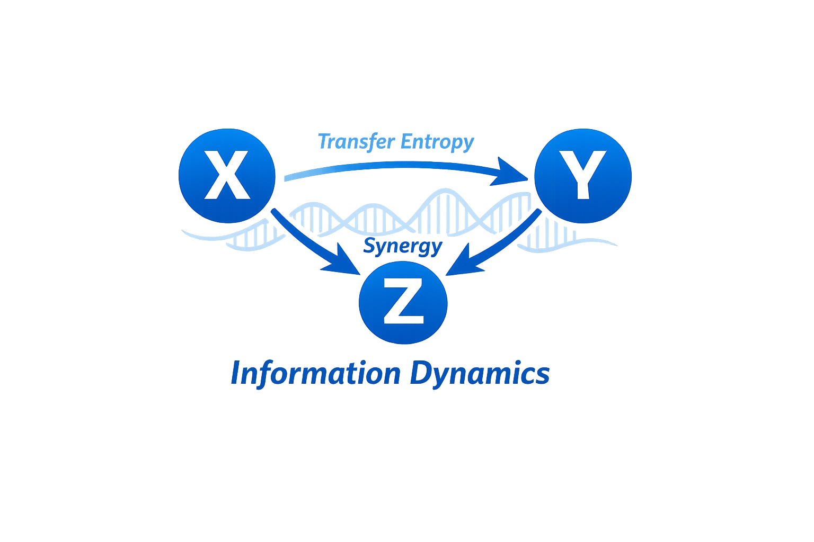

[](https://github.com/CarloNicolini/xyz/actions/workflows/ci.yml)
[](https://www.python.org/downloads/)
[](LICENSE)



# `XYZ`: **Information-theoretic estimators for continuous and time-series data.**

Understanding how different parts of a system share information, and in which direction influence flows, is a central question in the analysis of complex systems—from neural and physiological networks to financial markets and climate data. Information theory provides a principled, model-free language for this: entropy quantifies unpredictability or “how much is going on” in a process; mutual information measures shared information between variables; and transfer entropy captures the directed flow of information from one time series to another, conditioning out the past of the target. These quantities are especially useful when relationships are nonlinear or high-dimensional, where simple correlation or regression can miss important structure.

`xyz` implements estimators for these quantities on continuous and time-series data. It offers both parametric (Gaussian) and non-parametric (k-nearest neighbor and kernel) methods. The Gaussian estimators are fast and well-suited to approximately linear, Gaussian settings; the k-NN–based estimators (Kozachenko–Leonenko entropy, Kraskov–Stögbauer–Grassberger mutual information, and derived transfer entropy and self-entropy) are widely used in neuroscience and complex-systems research because they make minimal distributional assumptions and scale to multivariate and delay-embedded time series. The library also supports discrete (binned) estimators and partial information decomposition, so you can separate unique, redundant, and synergistic contributions of multiple sources to a target.

The implementation is validated against the ITS Toolbox workflow: the same nearest-neighbor logic and MEX-backed reference (TSTOOL) used there are reproduced in Python, and numerical parity is checked on fixed datasets. Beyond point estimates, `xyz` supports TRENTOOL-style workflows—embedding and delay selection (e.g. Ragwitz criterion), surrogate-based significance testing, and group or ensemble analyses—so that embedding choice and statistical testing are part of a reproducible pipeline.

`xyz` is a Python library that exposes these estimators through a scikit-learn–compatible API: fit/score, optional model selection, and clear separation between data preparation and estimation. It is aimed at researchers and practitioners who need rigorous, comparable information-theoretic analyses on real-world time series without leaving the Python ecosystem.

---

## Features

- **Entropy**: Multivariate Gaussian entropy; Kozachenko–Leonenko (KL) differential entropy; kernel-based entropy; univariate helpers in `xyz.univariate` (linear Gaussian, kernel).
- **Mutual information**: Kraskov–Stögbauer–Grassberger (KSG) estimator; Gaussian (linear) estimator.
- **Conditional entropy & conditional MI**: KSG-based and Gaussian (residual-based) estimators.
- **Transfer entropy**: Bivariate and partial transfer entropy via KSG, kernel, Gaussian (linear), and **discrete (binning-based)** methods.
- **Self-entropy (information storage)**: Kernel, Gaussian, and discrete (binning-based) estimators.
- **Partial information decomposition (PID)**: Decomposition of information from two sources about a target (unique, redundant, synergistic).
- **TRENTOOL-style workflow**: Embedding and delay search (`RagwitzEmbeddingSearchCV`, `InteractionDelaySearchCV`), surrogate-based significance testing (`SurrogatePermutationTest`, `generate_surrogates`), and group/ensemble helpers (`GroupTEAnalysis`, `EnsembleTransferEntropy`).

All estimators support multivariate inputs and return values in **nats** unless noted. Time-series estimators use delay embedding helpers from `xyz.preprocessing`; discrete TE/PTE/SE are available directly from the public `xyz` namespace.

---

## Transfer entropy: mathematical primer (continuous variables)

Transfer entropy (TE) measures the *directed* flow of information from one time series to another: how much the past of a *driver* process *X* helps predict the *target* process *Y* at the current time, over and above what is already contained in the past of *Y*. It was introduced by Schreiber (2000) and is now a standard tool in neuroscience, physiology, and complex-systems analysis.

**Setting.** Consider a bivariate (or multivariate) stochastic process. Denote by *Y*<sub>ᵗ</sub> the value of the target at time ᵗ, and by *Y*<sub>ᵗ</sub><sup>⁻</sup> the *embedded past* of the target—e.g. the vector (*Y*<sub>ᵗ−τ</sub>, *Y*<sub>ᵗ−2τ</sub>, …, *Y*<sub>ᵗ−*d*τ</sub>) for embedding dimension *d* and spacing τ. Similarly, *X*<sub>ᵗ</sub><sup>⁻</sup> is the embedded past of the driver. An *interaction delay* *u* can be used so that the driver’s past is taken at ᵗ−*u*; this is the lag at which *X* is thought to influence *Y*.

**Definition.** Bivariate transfer entropy from *X* to *Y* is the conditional mutual information between the driver’s past and the target’s present, given the target’s past:

- **TE**<sub>*X*→*Y*</sub> = *I*(*X*<sub>ᵗ</sub><sup>⁻</sup>; *Y*<sub>ᵗ</sub> | *Y*<sub>ᵗ</sub><sup>⁻</sup>) = *H*(*Y*<sub>ᵗ</sub> | *Y*<sub>ᵗ</sub><sup>⁻</sup>) − *H*(*Y*<sub>ᵗ</sub> | *Y*<sub>ᵗ</sub><sup>⁻</sup>, *X*<sub>ᵗ</sub><sup>⁻</sup>).

So TE is the reduction in uncertainty about *Y*<sub>ᵗ</sub> when we add *X*<sub>ᵗ</sub><sup>⁻</sup> to the conditioning set that already includes *Y*<sub>ᵗ</sub><sup>⁻</sup>. It is nonnegative (in the population) and zero if the driver’s past does not add predictive information beyond the target’s own past. *Partial* transfer entropy **PTE**<sub>*X*→*Y*|*Z*</sub> conditions also on a third (possibly multivariate) process *Z*<sub>ᵗ</sub><sup>⁻</sup>, so that only information not mediated or confounded by *Z* is counted. *Self-entropy* (information storage) is *H*(*Y*<sub>ᵗ</sub>) − *H*(*Y*<sub>ᵗ</sub> | *Y*<sub>ᵗ</sub><sup>⁻</sup>), i.e. how much of the present of *Y* is predictable from its own past.

**Continuous variables.** For continuous state variables, the entropies above are *differential* entropies (integrals of −*p* log *p* with respect to Lebesgue measure). They are estimated from data rather than computed in closed form. In `xyz`, the **Gaussian** (linear) estimators assume the relevant conditional distributions are Gaussian and express TE via residual covariances; they are fast and allow analytical significance tests. The **k-NN** (KSG-style) and **kernel** estimators are nonparametric: they approximate entropies from nearest-neighbor counts or fixed-radius kernel sums, making minimal distributional assumptions and capturing nonlinear dependence, at the cost of more data and tuning (embedding, *k* or radius). All of these estimators target the same theoretical quantity; the choice depends on the plausibility of linearity and the amount of data available.

---

## Installation

From the project root (Python ≥3.12):

```bash
pip install -e .
# or with uv:
uv pip install -e .
```

Dependencies: `numpy`, `scipy`, `scikit-learn`.

---

## Quick start

### Mutual information (KSG)

```python
import numpy as np
from xyz import KSGMutualInformation

X = np.random.randn(500, 2)
x, y = X[:, 0], X[:, 1].reshape(-1, 1)

mi_estimator = KSGMutualInformation(k=3)
mi_estimator.fit(x, y)
mi = mi_estimator.score(x, y)  # nats
```

### Transfer entropy (time series)

Bivariate transfer entropy with lagged embeddings (driver → target):

```python
from xyz import KSGTransferEntropy

# data: (n_samples, n_variables), e.g. (1000, 3)
data = np.random.randn(1000, 3)
te_estimator = KSGTransferEntropy(
    driver_indices=[0],
    target_indices=[1],
    lags=1,
    tau=1,
    delay=1,
    k=3,
)
te_estimator.fit(data)
te = te_estimator.transfer_entropy_  # TE(driver 0 → target 1)
```

### Gaussian (linear) transfer entropy with F-test

```python
from xyz import GaussianTransferEntropy

te_lin = GaussianTransferEntropy(
    driver_indices=[0],
    target_indices=[1],
    lags=1,
)
te_lin.fit(data)
te_value = te_lin.transfer_entropy_
p_value = te_lin.p_value_
```

### Entropy

```python
from xyz import KSGEntropy, MVNEntropy

# KSG (Kozachenko–Leonenko) differential entropy
h_ksg = KSGEntropy(k=3).fit(X).score(X)

# Multivariate Gaussian entropy (Cover & Thomas)
h_mvn = MVNEntropy().fit(X).score(X)
```

### Partial information decomposition

```python
from xyz import MVKSGPartialInformationDecomposition

pid = MVKSGPartialInformationDecomposition(k=3)
result = pid.score(X1, X2, y)
# result: unique_x1, unique_x2, redundant, synergistic, total
```

### Discrete (binning-based) transfer entropy

For binned or discretized time series, use the public discrete estimators:

```python
from xyz import DiscreteTransferEntropy

# Quantize continuous data into c bins (or pass already discrete indices)
te_disc = DiscreteTransferEntropy(
    driver_indices=[0],
    target_indices=[1],
    lags=1,
    c=8,
    quantize=True,
)
te_disc.fit(data)
te = te_disc.transfer_entropy_
```

### sklearn-style model selection

```python
from xyz import GaussianTransferEntropy, InteractionDelaySearchCV

search = InteractionDelaySearchCV(
    GaussianTransferEntropy(driver_indices=[0], target_indices=[1], lags=1),
    delays=[1, 2, 3, 4],
)
search.fit(data)

best_delay = search.best_delay_
best_te = search.best_score_
```

### TRENTOOL-style workflow (embedding, delay, significance)

Choose embedding dimension and spacing (Ragwitz), interaction delay, and test against surrogates:

```python
from xyz import (
    GaussianTransferEntropy,
    InteractionDelaySearchCV,
    RagwitzEmbeddingSearchCV,
    SurrogatePermutationTest,
)

base = GaussianTransferEntropy(driver_indices=[1], target_indices=[0], lags=1)

# Embedding search (Ragwitz prediction error)
embedding = RagwitzEmbeddingSearchCV(base, target_index=0, dimensions=(1, 2, 3), taus=(1, 2, 3))
embedding.fit(data)

# Delay search
delay = InteractionDelaySearchCV(base.set_params(**embedding.best_params_), delays=(1, 2, 3, 4, 5))
delay.fit(data)

# Surrogate permutation test
test = SurrogatePermutationTest(delay.best_estimator_, n_permutations=100)
test.fit(data)
# test.p_value_, test.reject_  (with optional FDR correction)
```

See the [model selection workflow](docs/source/examples/model_selection_workflow.rst) in the docs for a full example.

---

## ITS Toolbox (v2.1) numerical alignment

This project has been validated against the ITS Toolbox nearest-neighbor workflow described in `docs/ITS_Toolbox_v2.1.pdf`:

- The ITS slides define nearest-neighbor estimators (`its_Eknn.m`, `its_SEknn.m`, `its_BTEknn.m`, `its_PTEknn.m`) and explicitly rely on `nn_prepare`, `nn_search`, `range_search` imported from TSTOOL.
- The same document describes the KNN strategy used in ITS: find the `k`-th neighbor in the highest-dimensional space, then perform range counts in lower-dimensional projections to reduce bias.
- In this repository, parity was checked by compiling those MEX functions for Octave and comparing Octave ITS outputs to `xyz` outputs on the same fixed dataset (`tests/r.csv`).

### Function mapping (ITS -> `xyz`)

| ITS function | `xyz` equivalent |
|---|---|
| `its_Eknn` | `KSGEntropy` |
| `its_BTEknn` | `KSGTransferEntropy` |
| `its_PTEknn` | `KSGPartialTransferEntropy` |
| `its_SEknn` | `KSGSelfEntropy` |

### Reproducible evidence (`tests/r.csv`, `k=3`, max/chebyshev metric)

| Measure | Octave ITS (MEX-backed) | Python `xyz` |
|---|---:|---:|
| `Eknn_Hy` | `3.9808891418417671` | `3.9808891418417671` |
| `BTE_TE` | `0.032597986659973044` | `0.032597986659972822` |
| `BTE_Hy_xy` | `1.311313915036278` | `1.3113139150362785` |
| `PTE_TE` | `-0.054432883408784827` | `-0.054432883408783939` |
| `PTE_Hy_xyz` | `1.4286295797030166` | `1.4286295797030166` |
| `SE_Sy` | `0.02011865351899278` | `0.02011865351899067` |
| `SE_Hy_y` | `1.3548128271784674` | `1.3548128271784683` |

Agreement is at floating-point precision.

### Key implementation detail for parity

To match ITS `range_search(..., past=0)` behavior, KSG count stages in `xyz` exclude the query point itself (self-match) before boundary/tie correction. This was the critical source of prior TE/PTE/SE mismatch.

---

## Building ITS neighbor-search MEX files with Octave

The project includes a **Makefile** at the repo root that builds the three TSTOOL MEX files (`nn_prepare`, `nn_search`, `range_search`) for the current architecture (Linux and macOS). You need Octave and `mkoctfile` (e.g. `octave-dev` on Ubuntu, or `brew install octave` on macOS).

**Prebuilt MEX (no Octave required):** For each release, GitHub Actions builds MEX files on Linux (x86_64, aarch64) and macOS (x86_64, arm64) and attaches them to the [Releases](https://github.com/CarloNicolini/xyz/releases) page as `xyz-mex-<platform>-<arch>.zip`. Download the zip for your OS/architecture, unzip into `matlab/mex/`, and add `matlab`, `matlab/its`, and `matlab/mex` to your Octave/MATLAB path.

From the project root (to build from source):

```bash
make mex
```

This compiles the sources under `matlab/mex/tstool` with the flags required for ITS parity (including `-DMATLAB_MEX_FILE` and C++17 compatibility). To also build the Sphinx docs: `make docs`. To remove MEX artifacts and docs build: `make clean`. Run `make help` for a short summary.

To verify in Octave (from project root):

```bash
octave-cli --eval "addpath('matlab'); addpath('matlab/its'); addpath('matlab/mex'); which nn_prepare; which nn_search; which range_search"
```

Expected: all three resolve to `.mex` files in `matlab/mex`.

---

## Finance-focused interpretation

The ITS framework was developed for physiological networks, but the estimators are generic information-theoretic tools. For financial return systems, a practical interpretation is:

- Target process `Y`: asset/portfolio return to be explained.
- Driver process `X`: candidate predictive source (factor return, macro signal, market microstructure feature).
- Conditioning set `Z`: confounders/risk controls (benchmark factors, sector indices, volatility proxies).
- `TE(X->Y)`: incremental predictive information flow from `X` to future `Y` beyond `Y`'s own history.
- `PTE(X->Y|Z)`: directed information flow net of controls, useful for testing whether apparent influence survives conditioning.
- `SE(Y)`: information storage (predictability from own past), relevant for regime persistence and serial dependence diagnostics.

This alignment step (ITS parity) is the correct foundation before domain adaptation, model selection, significance testing, and robustness analysis on nonstationary financial data.

### Hedge-fund research framing

For discretionary or systematic research, `xyz` is best viewed as a toolkit for measuring predictive information rather than just linear correlation:

- **Signal orthogonality**: test whether a candidate signal still carries information about future returns after conditioning on benchmark factors, volatility, or sector moves via `MVKSGCondMutualInformation` or partial transfer entropy.
- **Lead-lag discovery**: quantify whether macro series, futures, options-implied variables, or cross-asset returns contain incremental information about a target book or sleeve at specific delays.
- **Regime persistence**: use self-entropy to detect whether a return, spread, or volatility process is mostly explained by its own past, which is useful for persistence and mean-reversion diagnostics.
- **Feature interaction**: use PID to separate whether two signals are redundant, uniquely informative, or only useful jointly through synergy.
- **Stress propagation**: build directed TE graphs across sectors, countries, or portfolio sleeves to monitor contagion and concentration of information flow during drawdowns.

A pragmatic workflow is usually:

1. Screen with `GaussianTransferEntropy` / `GaussianPartialTransferEntropy` for fast linear diagnostics and `p_value_`.
2. Re-test promising relationships with `KSGTransferEntropy` / `KSGPartialTransferEntropy` to relax Gaussian assumptions.
3. Search embedding and delay with `RagwitzEmbeddingSearchCV` and `InteractionDelaySearchCV`.
4. Confirm significance with `SurrogatePermutationTest`.
5. Repeat on rolling windows because financial dependencies are rarely stationary.

### Market microstructure framing

At higher frequency, the same estimators can be used on order-book and trade-derived state variables:

- **Target `Y`**: next mid-price move, short-horizon return, spread change, or realized volatility burst.
- **Driver `X`**: order-flow imbalance, trade sign, queue depletion, cancellation bursts, depth imbalance, or venue-specific activity.
- **Conditioning `Z`**: the target's own lagged history, spread regime, volatility state, auction flags, or broad market state variables.

This makes the estimators useful for questions such as:

- whether order-flow imbalance truly leads price moves beyond the target's own autocorrelation;
- whether one venue leads another in fragmented markets;
- whether a book feature adds unique information beyond simpler proxies;
- whether discretized states such as `up/flat/down` or spread buckets are better modeled with the public discrete estimators.

For microstructure work, the discrete estimators (`DiscreteTransferEntropy`, `DiscretePartialTransferEntropy`, `DiscreteSelfEntropy`) are especially handy when the data are naturally bucketed into states or when a researcher wants a robust first-pass state-transition analysis before moving to continuous KSG estimators.

---

## Development and CI/CD

- **Makefile** (root): `make mex` builds the ITS MEX files; `make docs` builds Sphinx HTML into `docs/build/html`; `make clean` removes MEX outputs and docs build.
- **Docker**: From the repo root, `docker build -t xyz-its-test .` builds an image with Octave, compiles the MEX files, and runs the test suite. Run tests with `docker run --rm xyz-its-test` (default command is `pytest tests/ -v`).
- **GitHub Actions**: CI runs on push and pull requests to `main`/`master`: tests on Ubuntu and macOS (Python 3.12, Octave, MEX build, pytest) and a docs build job. The release workflow publishes the package to PyPI when a GitHub release is published; set the `PYPI_API_TOKEN` repository secret to enable publishing.

---

## When to use which estimator

| Setting | Suggested estimator | Notes |
|--------|----------------------|------|
| Approximately Gaussian, linear dependencies | `MVNEntropy`, `GaussianTransferEntropy`, etc. | Fast; F-tests available for TE/SE. |
| General continuous data, no Gaussian assumption | `KSGEntropy`, `KSGMutualInformation`, `KSGTransferEntropy` | k-NN based; robust, widely used. |
| Bivariate / partial TE with lagged time series | `KSGTransferEntropy`, `KSGPartialTransferEntropy` | Uses delay embedding (see `buildvectors` in `xyz.utils`). |
| Nonparametric TE with fixed radius | `KernelTransferEntropy`, `KernelPartialTransferEntropy`, `KernelSelfEntropy` | Radius `r` must be chosen. |
| Binned or discretized time series | `DiscreteTransferEntropy`, `DiscretePartialTransferEntropy`, `DiscreteSelfEntropy` | Available from `xyz`; set `c` bins or pass pre-quantized data. |
| TRENTOOL-style: choose embedding, delay, and test significance | `RagwitzEmbeddingSearchCV`, `InteractionDelaySearchCV`, `SurrogatePermutationTest` | Use with any TE estimator; see model selection workflow in docs. |

KSG and kernel estimators can occasionally yield small negative values due to finite-sample bias; for weak dependencies, Gaussian or significance tests may be more stable.

---

## References

- **Cover, T. M., & Thomas, J. A.** (2006). *Elements of Information Theory* (2nd ed.). Wiley. (Gaussian entropy, conditional entropy.)
- **Kozachenko, L. F., & Leonenko, N. N.** (1987). Sample estimate of the entropy of a random vector. *Problemy Peredachi Informatsii*, 23(2), 9–16. (KL entropy estimator.)
- **Kraskov, A., Stögbauer, H., & Grassberger, P.** (2004). Estimating mutual information. *Physical Review E*, 69(6), 066138. (KSG MI and related estimators.)
- **Schreiber, T.** (2000). Measuring information transfer. *Physical Review Letters*, 85(2), 461–464. (Transfer entropy.)
- **Williams, P. L., & Beer, R. D.** (2010). Nonnegative decomposition of multivariate information. *arXiv:1004.2515*. (Partial information decomposition.)
- **Faes, L.** (2019). *ITS Toolbox v2.1: A Matlab toolbox for the practical computation of Information Dynamics*. See `docs/ITS_Toolbox_v2.1.pdf`.
- **TSTOOL** nearest-neighbor engine (`nn_prepare`, `nn_search`, `range_search`) from University of Goettingen, used by ITS KNN estimators.
- **TRENTOOL**-style workflows: embedding optimization (Ragwitz), interaction delay search, and surrogate permutation testing for significance; see the [model selection workflow](docs/source/examples/model_selection_workflow.rst) in the docs.

For more detail on the multivariate KSG API and use cases, see [MULTIVARIATE_KSG_GUIDE.md](MULTIVARIATE_KSG_GUIDE.md).

---

## License

See repository for license information.
